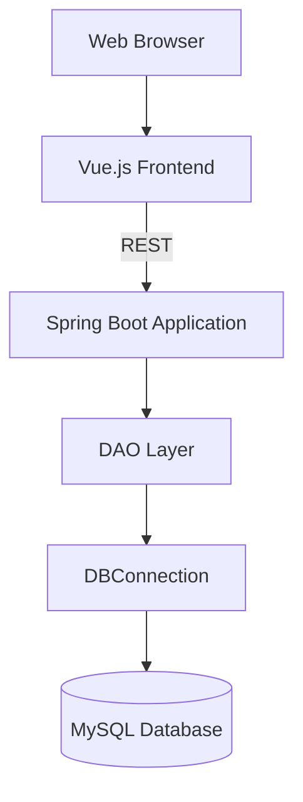

## Banking Application

A modern Banking Application using Spring Boot for the backend and Vue.js for the frontend. The original JSP based UI has been replaced by a Vue single page application that communicates with the server via REST APIs.

### Architecture Diagram


### Project Structure
```
banking-app/
├── frontend/
│   └── index.html
├── src/
│   └── main/
│       ├── java/
│       │   └── com/
│       │       └── banking/
│       │           ├── api/
│       │           │   ├── BankingApiApplication.java
│       │           │   └── controller/
│       │           │       └── AccountController.java
│       │           ├── dao/
│       │           │   ├── AccountDAO.java
│       │           │   └── TransactionDAO.java
│       │           ├── model/
│       │           │   ├── Account.java
│       │           │   └── Transaction.java
│       │           └── util/
│       │               └── DBConnection.java
│       └── resources/
│           └── application.properties
└── pom.xml
```

### Database Schema
(unchanged, see previous version for full SQL)

### Running the Application
1. Start MySQL and create the schema using the provided SQL.
2. Update credentials in `DBConnection.java` if needed.
3. Run the backend:
```bash
mvn spring-boot:run
```
4. Open `frontend/index.html` in a browser and interact with the application.
