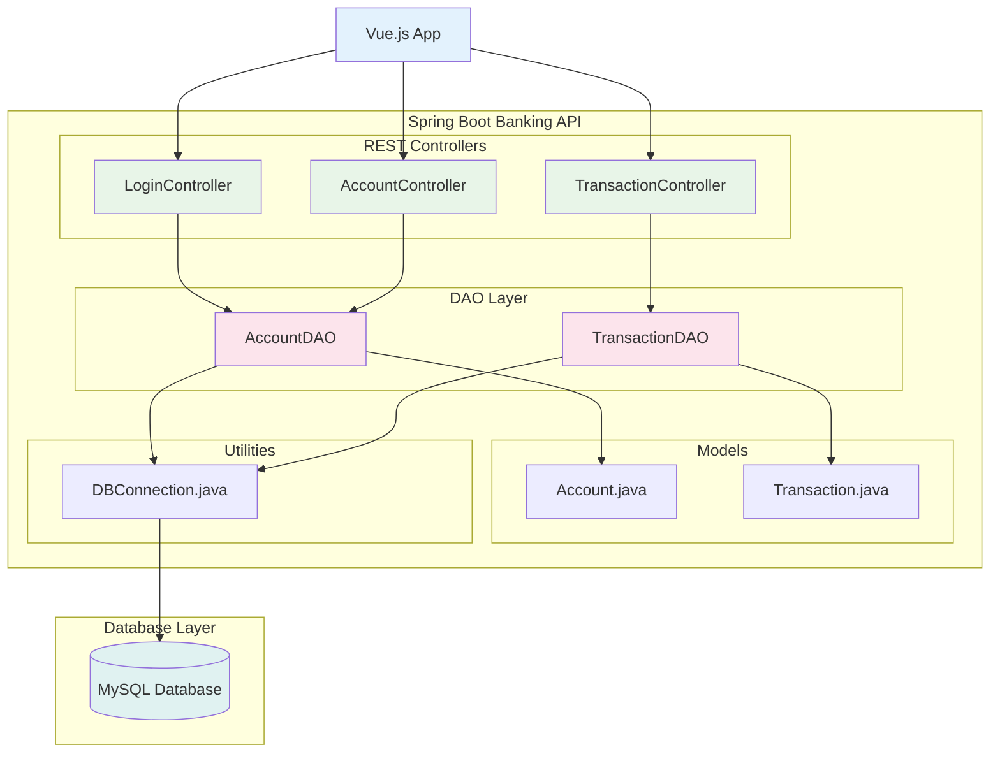

##  Banking Application

Modern Banking Application built with Spring Boot REST API and Vue.js frontend.

### Architecture Diagram
The modernized application exposes REST endpoints through Spring Boot while the Vue.js frontend communicates with these APIs.



### Project Structure
```
banking-app/
├── src/
│   └── main/
│       ├── java/
│       │   └── com/
│       │       └── banking/
│       │           ├── model/
│       │           │   ├── Account.java
│       │           │   └── Transaction.java
│       │           ├── dao/
│       │           │   ├── AccountDAO.java
│       │           │   └── TransactionDAO.java
│       │           ├── controller/
│       │           │   ├── LoginServlet.java
│       │           │   ├── DashboardServlet.java
│       │           │   ├── TransactionServlet.java
│       │           │   └── LogoutServlet.java
│       │           └── util/
│       │               └── DBConnection.java
│       └── webapp/
│           ├── WEB-INF/
│           │   ├── web.xml
│           │   └── lib/
│           ├── jsp/
│           │   ├── login.jsp
│           │   ├── dashboard.jsp
│           │   ├── transaction.jsp
│           │   └── error.jsp
│           ├── css/
│           │   └── style.css
│           └── index.jsp
└── pom.xml
```

### Database Schema

```sql
-- Create database
CREATE DATABASE banking_db;
USE banking_db;

-- Accounts table
CREATE TABLE accounts (
    account_id INT PRIMARY KEY AUTO_INCREMENT,
    account_number VARCHAR(20) UNIQUE NOT NULL,
    customer_name VARCHAR(100) NOT NULL,
    email VARCHAR(100) UNIQUE NOT NULL,
    password VARCHAR(100) NOT NULL,
    balance DECIMAL(10, 2) DEFAULT 0.00,
    created_at TIMESTAMP DEFAULT CURRENT_TIMESTAMP
);

-- Transactions table
CREATE TABLE transactions (
    transaction_id INT PRIMARY KEY AUTO_INCREMENT,
    account_id INT,
    transaction_type ENUM('DEPOSIT', 'WITHDRAWAL', 'TRANSFER') NOT NULL,
    amount DECIMAL(10, 2) NOT NULL,
    description VARCHAR(255),
    transaction_date TIMESTAMP DEFAULT CURRENT_TIMESTAMP,
    FOREIGN KEY (account_id) REFERENCES accounts(account_id)
);

-- Sample data
INSERT INTO accounts (account_number, customer_name, email, password, balance) VALUES
('ACC001', 'Otto', 'otto@gmail.com', 'password123', 5000.00),
('ACC002', 'Rich', 'rich@gmail.com', '123456', 1000.00);
```

### Deployment Instructions
1. Set up MySQL Database
- Install MySQL Server with docker
```
docker run --name mysql -e MYSQL_ROOT_PASSWORD=password -p 3306:3306 -d mysql:8.0
```

- Create the database and tables using the provided SQL scripts
```
docker exec -it mysql mysql -uroot -p
```

- Update database credentials in DBConnection.java

2. Build the Application
```
mvn clean package
```

3. Run the Application
```
mvn spring-boot:run
```

4. Access the Application:
```
Open browser and navigate to: http://localhost:8081/banking-app
Login with sample credentials:
Email: rich@gmail.com, Password: 123456
```


