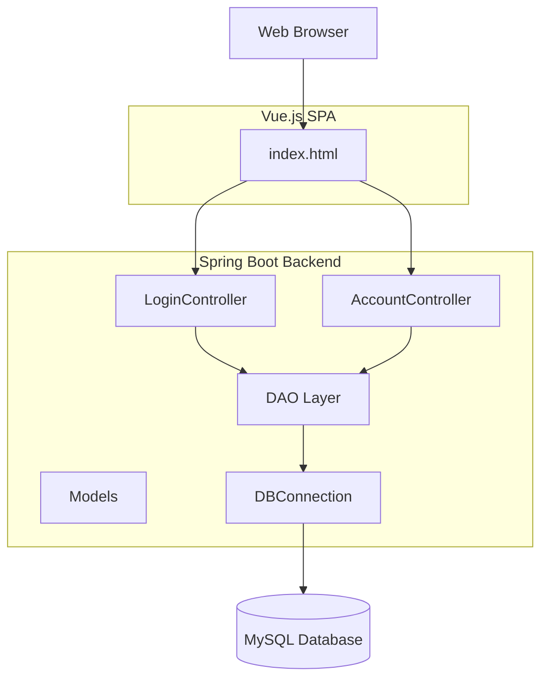

## Banking Application

This project modernizes the original JSP/Servlet based banking application by replacing the frontend with Vue.js and rewriting the backend using Spring Boot 3.5 (Java 21). The REST API is exposed under the `/banking-app` context path so existing endpoints remain compatible.

### Architecture Diagram



### Project Structure
```
banking-app/
├── src/
│   ├── main/
│   │   ├── java/com/banking/
│   │   │   ├── api/                # REST controllers
│   │   │   ├── dao/                # Data access objects
│   │   │   ├── model/              # Domain models
│   │   │   ├── util/               # Utilities (DB connection)
│   │   │   └── BankingAppApplication.java
│   │   └── resources/
│   │       ├── application.properties
│   │       └── static/index.html   # Vue.js front end
│   └── test/java/com/banking/api/  # Spring MVC tests
└── pom.xml
```

### Database Schema
The database schema remains the same as the previous version and can be found in the `sql` section below.

```sql
-- Create database
CREATE DATABASE banking_db;
USE banking_db;

-- Accounts table
CREATE TABLE accounts (
    account_id INT PRIMARY KEY AUTO_INCREMENT,
    account_number VARCHAR(20) UNIQUE NOT NULL,
    customer_name VARCHAR(100) NOT NULL,
    email VARCHAR(100) UNIQUE NOT NULL,
    password VARCHAR(100) NOT NULL,
    balance DECIMAL(10, 2) DEFAULT 0.00,
    created_at TIMESTAMP DEFAULT CURRENT_TIMESTAMP
);

-- Transactions table
CREATE TABLE transactions (
    transaction_id INT PRIMARY KEY AUTO_INCREMENT,
    account_id INT,
    transaction_type ENUM('DEPOSIT', 'WITHDRAWAL', 'TRANSFER') NOT NULL,
    amount DECIMAL(10, 2) NOT NULL,
    description VARCHAR(255),
    transaction_date TIMESTAMP DEFAULT CURRENT_TIMESTAMP,
    FOREIGN KEY (account_id) REFERENCES accounts(account_id)
);
```

### Running the Application
1. **Set up MySQL** (same as before)
   ```bash
   docker run --name mysql -e MYSQL_ROOT_PASSWORD=password -p 3306:3306 -d mysql:8.0
   docker exec -it mysql mysql -uroot -p
   ```
2. **Build and run**
   ```bash
   mvn clean package
   java -jar target/banking-app.jar
   ```
3. **Access the app**
   Open `http://localhost:8081/banking-app` in your browser.
