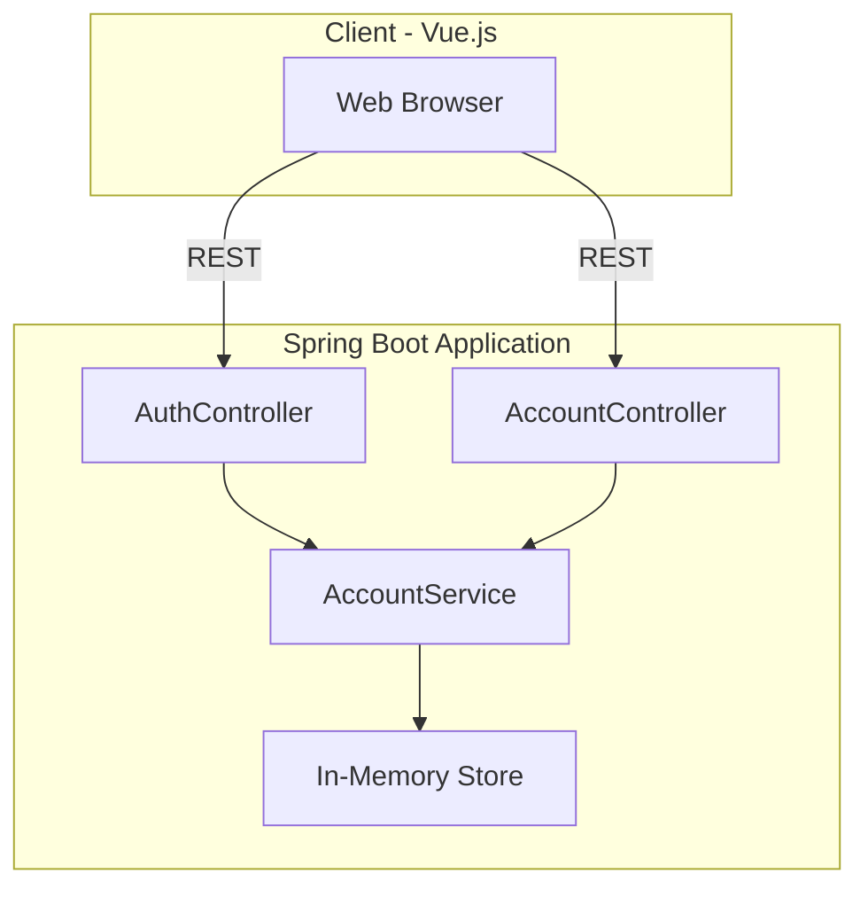

## Banking Application

This project modernizes the original JSP/Servlet banking app by adopting Vue.js on the front end and Spring Boot on the back end. The application exposes REST APIs and preserves the original entry point `http://localhost:8081/banking-app`.

### Architecture Diagram
The new architecture decouples the client and server while keeping a simple in-memory data store.



### Running the Application
1. **Build**
```bash
mvn clean package
```
2. **Run**
```bash
java -jar target/banking-app-1.0-SNAPSHOT.jar
```
3. **Access**
Open `http://localhost:8081/banking-app` in the browser and log in with:
```
Email: rich@gmail.com
Password: 123456
```

### Project Structure
```
banking-app/
├── src/
│   ├── main/java/com/banking/...
│   └── main/resources/static/... (Vue.js frontend)
└── pom.xml
```
