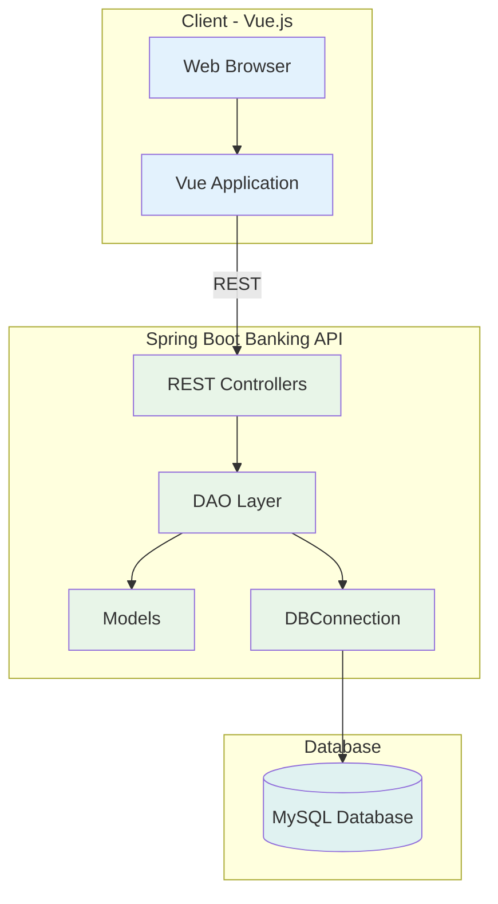

##  Banking Application

A modernized banking application using Spring Boot and Vue.js. The backend exposes REST APIs while the frontend is a Vue single page application served from Spring Boot.

### Architecture Diagram
The new architecture decouples the UI from the backend. Vue.js communicates with Spring Boot REST endpoints which in turn access the database using the existing DAO layer.


```mermaid
graph TB
    subgraph "Client - Vue.js"
        Browser[Web Browser]
        Vue[Vue Application]
        Browser --> Vue
    end

    subgraph "Spring Boot Banking API"
        Controller[REST Controllers]
        DAO[DAO Layer]
        Models[Models]
        Util[DBConnection]
    end

    subgraph "Database"
        MySQL[(MySQL Database)]
    end

    Vue -- REST --> Controller
    Controller --> DAO
    DAO --> Models
    DAO --> Util
    Util --> MySQL

    classDef client fill:#e3f2fd
    classDef backend fill:#e8f5e8
    classDef database fill:#e0f2f1

    class Browser,Vue client
    class Controller,DAO,Models,Util backend
    class MySQL database
```

### Project Structure
```
banking-app/
├── src/
│   ├── main/
│   │   ├── java/
│   │   │   └── com/banking/
│   │   │       ├── api/
│   │   │       │   └── AccountController.java
│   │   │       ├── dao/
│   │   │       │   ├── AccountDAO.java
│   │   │       │   └── TransactionDAO.java
│   │   │       ├── model/
│   │   │       │   ├── Account.java
│   │   │       │   └── Transaction.java
│   │   │       ├── util/
│   │   │       │   └── DBConnection.java
│   │   │       └── Application.java
│   │   └── resources/
│   │       ├── static/
│   │       │   ├── index.html
│   │       │   └── style.css
│   │       └── application.properties
└── pom.xml
```

### Database Schema

```sql
-- Create database
CREATE DATABASE banking_db;
USE banking_db;

-- Accounts table
CREATE TABLE accounts (
    account_id INT PRIMARY KEY AUTO_INCREMENT,
    account_number VARCHAR(20) UNIQUE NOT NULL,
    customer_name VARCHAR(100) NOT NULL,
    email VARCHAR(100) UNIQUE NOT NULL,
    password VARCHAR(100) NOT NULL,
    balance DECIMAL(10, 2) DEFAULT 0.00,
    created_at TIMESTAMP DEFAULT CURRENT_TIMESTAMP
);

-- Transactions table
CREATE TABLE transactions (
    transaction_id INT PRIMARY KEY AUTO_INCREMENT,
    account_id INT,
    transaction_type ENUM('DEPOSIT', 'WITHDRAWAL', 'TRANSFER') NOT NULL,
    amount DECIMAL(10, 2) NOT NULL,
    description VARCHAR(255),
    transaction_date TIMESTAMP DEFAULT CURRENT_TIMESTAMP,
    FOREIGN KEY (account_id) REFERENCES accounts(account_id)
);

-- Sample data
INSERT INTO accounts (account_number, customer_name, email, password, balance) VALUES
('ACC001', 'Otto', 'otto@gmail.com', 'password123', 5000.00),
('ACC002', 'Rich', 'rich@gmail.com', '123456', 1000.00);
```

### Deployment Instructions
1. Set up MySQL Database
- Install MySQL Server with docker
```
docker run --name mysql -e MYSQL_ROOT_PASSWORD=password -p 3306:3306 -d mysql:8.0
```

- Create the database and tables using the provided SQL scripts
```
docker exec -it mysql mysql -uroot -p
```

- Database credentials can be configured with the `DB_URL`, `DB_USER` and
  `DB_PASSWORD` environment variables.

2. Build the Application
```
mvn clean package
```

3. Run the Spring Boot jar
```
java -jar target/banking-app.jar
```

4. Access the Application:
```
Open browser and navigate to: http://localhost:8081/banking-app
Login with sample credentials:
Email: rich@gmail.com, Password: 123456
```

5. Build the Docker image
```bash
docker build -t banking-app .
```

6. Run with Docker
```bash
docker run -p 8081:8081 \
  -e DB_URL=jdbc:mysql://localhost:3306/banking_db \
  -e DB_USER=root -e DB_PASSWORD=password \
  banking-app
```

7. Deploy to Kubernetes
```bash
kubectl apply -f k8s/banking-app.yml
```


