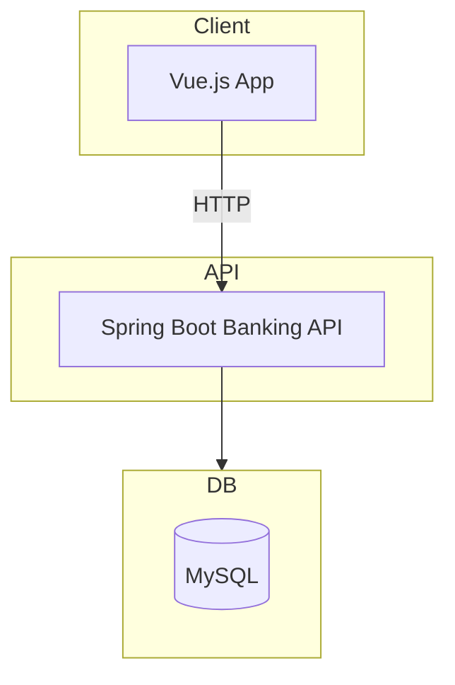

# Modernization Plan

This document outlines the approach to migrate the legacy JSP/Servlet banking application
into a modern Spring Boot based REST API with a separate frontend.

## Current State

The existing project is a monolithic Java web application implemented with JSP and
Servlets. It uses JDBC for database access and requires deployment to a servlet
container. The architecture is described in `banking_architecture.mermaid`.

## Target Architecture

- **Spring Boot 3.5** running on Java 21
- RESTful API exposing account and transaction endpoints
- Stateless services following microservices principles
- Frontend implemented with a lightweight framework such as Vue.js communicating via HTTP APIs
- Containerized deployment via Docker



## Spring Boot Module

A new module `springboot-app` has been added containing a minimal Spring Boot
application. It exposes `/api/accounts/login` and `/api/accounts/deposit` to
demonstrate the modernized approach. The module can be started with:

```bash
mvn -f springboot-app/pom.xml spring-boot:run
```

This skeleton serves as a starting point for gradually migrating existing
features.

## Vue Frontend

The legacy JSP pages have been reimplemented using Vue.js. These pages live in the `vue-frontend` directory and reuse the original `style.css` to preserve the look and feel. The HTML files communicate with the Spring Boot API using `fetch`:

- `login.html` handles user login and stores the returned account object in `localStorage`.
- `dashboard.html` shows account information and transaction history.
- `transaction.html` posts a deposit or withdrawal to the API.

To try the new frontend, start the Spring Boot application and open `vue-frontend/login.html` in your browser.
